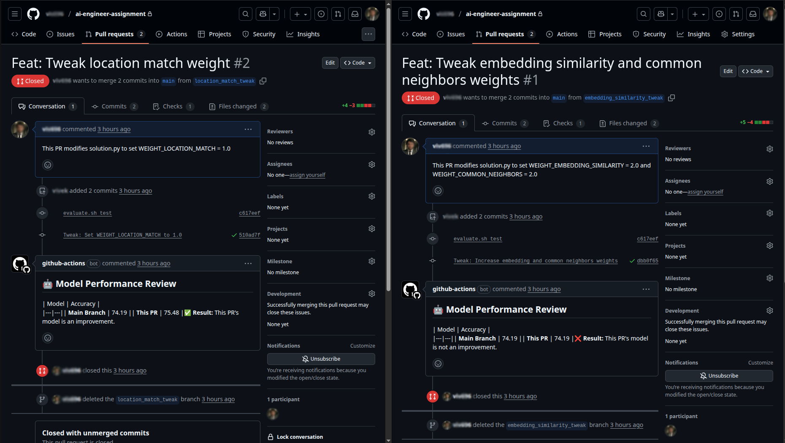

# Sample Submission Evaluation Script Results

This document summarizes the output of the `evaluate.sh` script after ran on a candidates git repository, breaking down the results for each task.

---

## Task 1: Performance Check (`scripts/solution.py`)

The script ran successfully.

-   **Key Metric:** Script Execution Time
    -   `real`: **`0m11.025s`**
    -   `user`: `0m21.132s`
    -   `sys`: `0m1.103s`

<details>
<summary>Full Script Output</summary>

```
--- Manager Prediction using Hybrid Scoring (Embeddings + Graph Features) ---
Step 1: Loading data...
Loaded 777 employees and 2026 connections.
Step 2: Engineering features and building graph...
   - Generating text embeddings...
Batches: 100%|█████████████████████████████████████████████████████████████████████████████████████████████████████████████| 25/25 [00:02<00:00,  9.68it/s]
   - Constructing NetworkX graph...
   - Graph built with 777 nodes and 2026 edges.
Step 3: Scoring all possible employee-manager pairs...
Scoring Progress: 100%|████████████████████████████████████████████████████████████████████████████████████████████████| 777/777 [00:00<00:00, 1909.04it/s]
Step 4: Building hierarchy and preventing cycles...
Assigning Managers: 100%|████████████████████████████████████████████████████████████████████████████████████████████| 1728/1728 [00:00<00:00, 7375.16it/s]
Step 5: Generating Submission File...
Processing complete. Cycle-free submission file saved as 'submission.csv'.
```
</details>

---

## Task 2: Performance Check (`serving/serve.py`)

The Flask server started, and the test request was successful.

-   **Key Metric:** Server Response Time
    -   `real`: **`0m11.944s`**
    -   `user`: `0m0.024s`
    -   `sys`: `0m0.029s`

<details>
<summary>Full Server and Request Output</summary>

```
INFO: Starting the Flask server in the background...
INFO: Waiting for the server to start (60 SECONDS WAIT)...
 * Serving Flask app 'serve'
 * Debug mode: on
... (Flask startup messages) ...
INFO: Measuring response time using './tests/send_request.sh'...
... (curl progress bar) ...
--- Manager Prediction using Hybrid Scoring (Embeddings + Graph Features) ---
... (solution.py output) ...
--- Visualization Complete! ---
127.0.0.1 - - [14/Oct/2025 01:55:34] "POST /predict HTTP/1.1" 200 -
Request sent. Server response saved to curl_response.html
```
</details>

---

## Task 3: Docker Build and Verification

The Docker image was built successfully, and the containerized service responded to the test request.

-   **Key Metric:** Docker Build Time: **`200.4s`**
-   **Result:** The container started and the test request was successful.

<details>
<summary>Full Docker Output</summary>

```
[+] Building 200.4s (10/10) FINISHED
... (docker build logs) ...
INFO: Cleaning up existing container if it exists...
INFO: Running the Docker container in the background...
742d2b2ddf1a248850b609bcdc88db069187b643a648a5b342e366a82f24dcbe
INFO: Waiting for the container to start (60 SECONDS WAIT)...
INFO: Sending a test request to the containerized service...
... (curl progress bar) ...
Request sent. Server response saved to curl_response.html
INFO: Cleaning up the running container...
reporting-line-prediction-service
```
</details>

---

## Task 4: Pull Request Workflow Simulation

Two pull requests were created successfully to test the CI workflow.

-   **Key Metric:** Pull Request URLs
    -   Performance Decrease PR: **`https://github.com/githubuser/ai-engineer-assignment/pull/1`**
    -   Performance Increase PR: **`https://github.com/githubuser/ai-engineer-assignment/pull/2`**

- 
<details>
<summary>Full Git and GitHub CLI Output</summary>

```
INFO: Cleaning up potentially leftover branches and PRs from previous runs...
... (git cleanup logs) ...
INFO: Creating a branch with a performance DECREASE ('location_match_tweak')...
... (git and gh logs) ...
INFO: Creating a branch with a performance INCREASE ('embedding_similarity_tweak')...
... (git and gh logs) ...
INFO: Two pull requests have been created.
```
</details>

---

## Task 5: Continuous Deployment (CD) Workflow Verification

This step requires manual verification.

-   **Action:** After merging the successful PR (`/pull/2`), go to the "Actions" tab in the GitHub repository to confirm that the `serve` workflow was triggered and a new Docker image was published.
